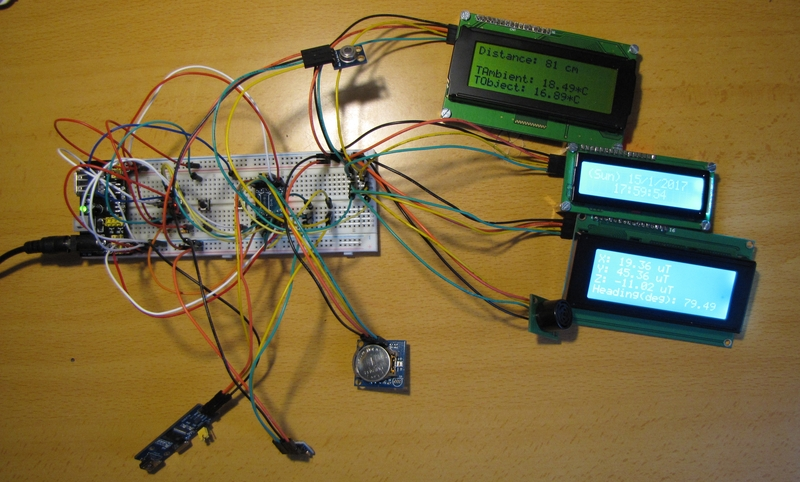
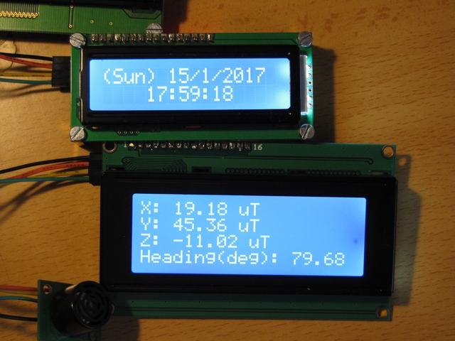

# What's that?

Code samples/examples used by me in my ESP8266 projects. Use them to your own.

Published under GNU/GPL v3.0 or higher.

# What's included in these folders?

* **esp8266_i2c**: An ESP-01(ESP8266) mastering many I2C devices, such as HMC5883 3 axis digital compass, GY-901/MLX90614 IR thermometer, SFR-02 ultrasonic module, DS1307 RTC and 3 LCD modules with I2C adaptors.

* **wifi_scan:** This little program looks for available wifis around and displays in serial console the results. Waits for 50 seconds and restarts the scannig.

* **simple_webserver:** As its name states, creates a simple web server reachable from your web browser, allowing you to activate/deactivate a couple of its GPIO pins.

* **ESPwebform:** Turns on and off a led attached to pin 2 on a ESP-01 device.